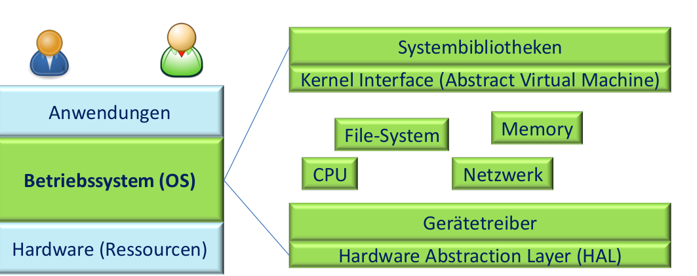
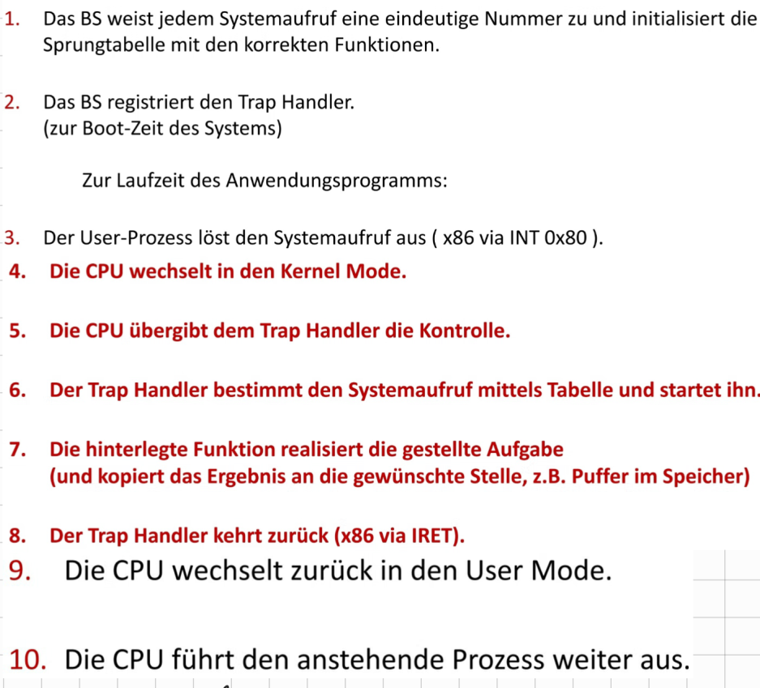
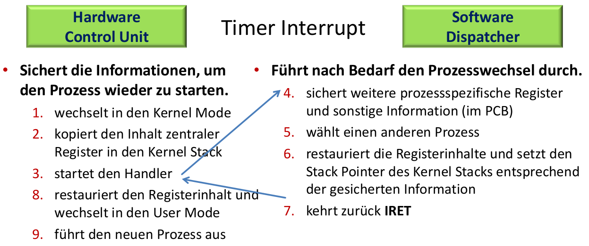

# Grundlagen betriebssysteme

> Abstrahiert und managet



## Abstrahiert:

Standard Bibl. für:

* CPU Prozesse & Threads
* Speicher virt. Addr.
* Platte Dateien & Verzeichnisse
* Netzwerk Sockets

PRO | CON
--- | ---
Nicht um Hardware Aufg. kümmern und bekommen einheitliche Geräteschnittstellen angeboten | Richt. Abstraktionslevel?
 -   | Welche Funktionalität?
  -  | Wie viel Hardware sehen?

## Managet

Moderator | Magier
--------- | ------
Teil Ressourcen zwisch. Anwender | Jede Anwend. hat Maschine für sich
Schirm Anwendungen ab | Speicher unendlich
   - | Dateien beliebig wachsen

PRO | CON
--- | ---
Anwend. gegenseitig nicht stören -> Zuteilung Fair & effektiv! | Wie Abschirmung?
- | Wie Hardware virtualisiert?
- | Wie Faire Zuteilung?

<!-- TODO Herausforderungen relevant ? (Folie 15 - 20) -->

# Virtualisierung der CPU

<!-- TODO Rechnerarchitektur ? (Siehe Folien) -->

* Prozesse: Sequentielle Ausführung eines Programms
  - Besteht aus:
    1. Programm => Adressraum
    2. Daten(Heap/Stack) => Adressraum
    3. Register
    4. Offene Dateien
    5. Netzwerk Verbind.

==> Werden im __PCB__ zusammengefasst!


Prozess | Programm
------- | --------
Ausfürung des Programms = __Dynamisch__ | __Statisches__ best. aus code & Daten

Prozess `<!=>` Programm

==> Zu Programm viele Prozesse & Jedes Programm **eindeutige PID**

## Programm ausführen

### Limited direct execution

1. Normale Prozesse -> **User Mode**(Restricted Mode)
2. BS -> **Kernel Mode**(Priviledged Mode)
  * Schreiben Geräteregister
  * Zugriff Memory
  * Anhalten CPU
  * Ändern Mode
  * Aktivierung/Deakt. Interrupts

==> __Protection Ring__(Current Privilege Level) = Prozessor prüft ob Berecht. vorliegen bei jeder Instruktion

#### Auf geschützte Funkt. zuzugreifen

> Kontrolle an BS wieder zurückzugeben

* Falltür um auf Kernelebebene abzusteigen = **Trap Konstr.**
* Interface um Funkt. auszuwählen:

```assembly
mov $0x4,%eax # Systemaufruf (4 = Linux write)
int $0x80     # Wechsel in den Kernel Mode(Trap)
```

Vorgang:

<!-- TODO write out instead of image -->


**Missachtung der Regeln**: BS terminiert Prozess

### BS managet Prozesse

1. Mechanismus: Dispatcher
  * Wie Prozess angehalten?
  * Wie Prozess gestartet?
2. Strategie: Scheduler
  * Wann Prozess angehalten?
  * Mit welchem fortgefahren?

#### Dispatcher Loop

1. Kooperativer Ansatz: Vertrauen auf Anwendungen
  * Systemaufruf(I/O) findet regelmäßig statt
  * `yield()`

=> Kein Zwang & fehlerhaft

2. Nicht Kooperativ: **Hardware Timer(HPET)** lösen in regelmäßige Abst.(~1ms) Interrupts aus.



> A process control Block(PCB) is a data structure used by computer operating systems to store all the information about a process. It is also known as a process descriptor.

<!-- TODO migrate handwritten documentation in ../legacy -->
