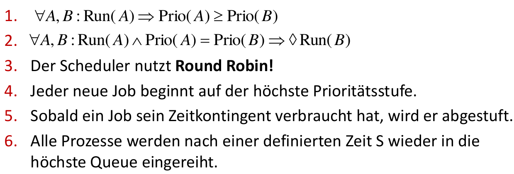
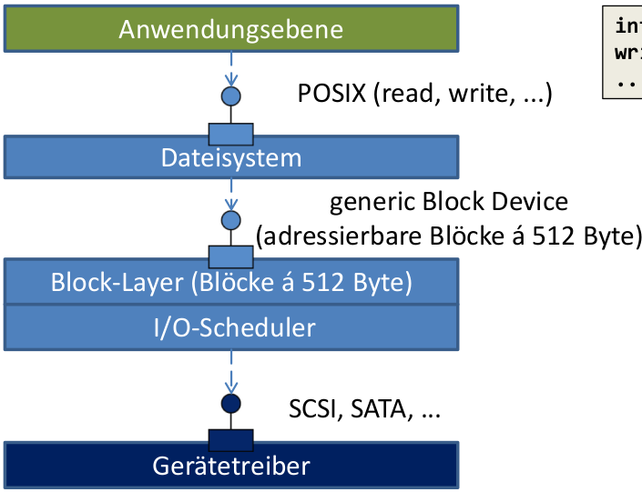
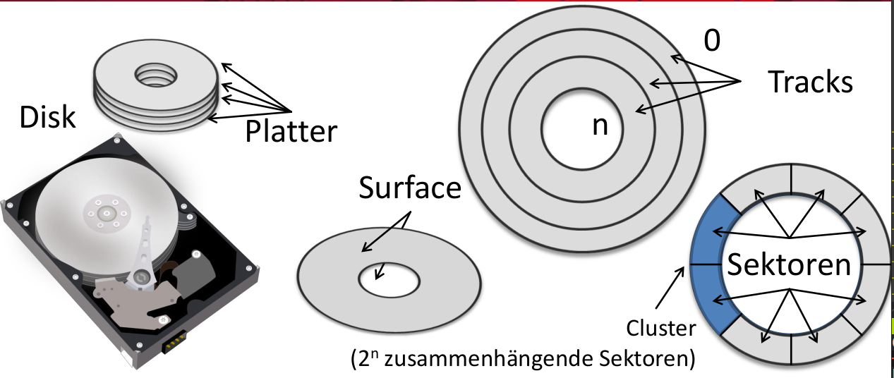
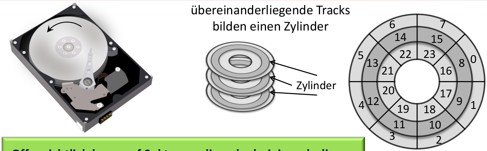
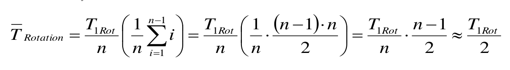
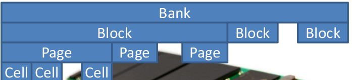
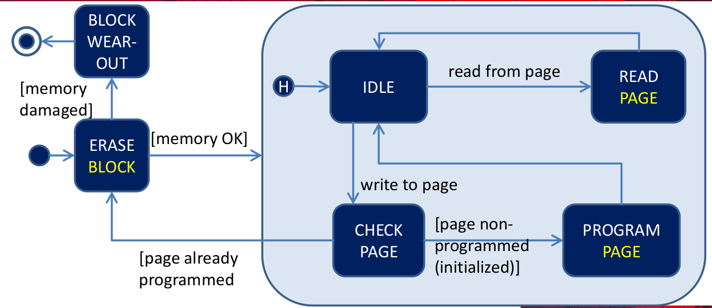
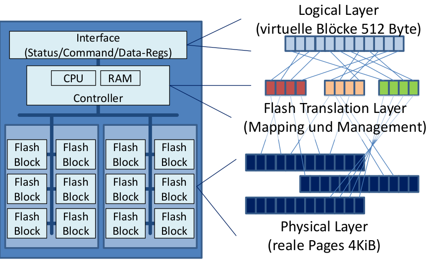
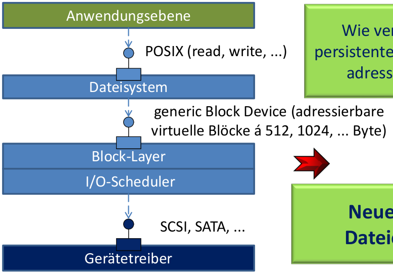
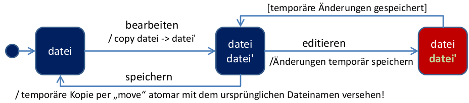

- [Grundlagen betriebssysteme](#grundlagen-betriebssysteme)
  * [Abstrahiert](#abstrahiert)
  * [Managet](#managet)
- [Virtualisierung der CPU](#virtualisierung-der-cpu)
  * [Programm ausführen](#programm-ausfuhren)
    + [Limited direct execution](#limited-direct-execution)
      - [Auf geschützte Funkt. zuzugreifen](#auf-geschutzte-funkt-zuzugreifen)
    + [BS managet Prozesse](#bs-managet-prozesse)
      - [Dispatcher Loop](#dispatcher-loop)
    + [BS verwaltet Prozesse](#bs-verwaltet-prozesse)
    + [Zusammenfassung CPU - Virtualisierung](#zusammenfassung-cpu---virtualisierung)
  * [Scheduling](#scheduling)
    + [FIFO](#fifo)
    + [SJF](#sjf)
    + [STCF(Shortest Time to Completion First)](#stcfshortest-time-to-completion-first)
    + [Round Robin](#round-robin)
    + [Zusammenhang Reaktionszeit Umlaufzeit](#zusammenhang-reaktionszeit--umlaufzeit)
    + [MLFQ(Multi-Level-Feedback-Queue)](#mlfqmulti-level-feedback-queue)
      - [Zusammenfassung MLFQ](#zusammenfassung-mlfq)
    + [Lotterie-Scheduling](#lotterie-scheduling)
  * [Persistenz, Dateisysteme & I/O](#persistenz-dateisysteme--io)
    + [Peripheriegerät(Schnittstelle)](#peripheriegeratschnittstelle)
    + [Performance](#performance)
      - [Beispiel](#beispiel)
    + [Gerätetreiber](#geratetreiber)
    + [Block-Layer](#block-layer)
  * [Festplatten](#festplatten)
    + [Interface](#interface)
    + [Hardware](#hardware)
      - [Lesen/Schreiben eines Sektors](#lesenschreiben-eines-sektors)
        * [Seek-Time](#seek-time)
        * [Rotationsverzögerung](#rotationsverzogerung)
        * [Performance](#performance-1)
        * [Caching/Prefetching](#cachingprefetching)
  * [I/O-Scheduling](#io-scheduling)
    + [FCFS(First come, first serve)](#fcfsfirst-come-first-serve)
    + [SPTF(Shortest Positioning Time first)](#sptfshortest-positioning-time-first)
    + [Scheduling(SCAN)](#schedulingscan)
      - [Scheduling(SCAN) Varianten](#schedulingscan-varianten)
  * [Hardware(SSD)](#hardwaressd)
    + [SSDs Varianten](#ssds-varianten)
    + [Flash: Speicherhierarchien](#flash-speicherhierarchien)
    + [Flash: Operationen](#flash-operationen)
    + [Lifecycle eines Blocks](#lifecycle-eines-blocks)
    + [Zustände einer Page](#zustande-einer-page)
    + [Hardware einer SSD](#hardware-einer-ssd)
      - [Flash Translation Layer](#flash-translation-layer)
  * [File-System](#file-system)
    + [Dateien & Verzeichnisse](#dateien--verzeichnisse)
    + [Inodes](#inodes)
    + [Verzeichnisse](#verzeichnisse)
    + [Umgang mit Dateien](#umgang-mit-dateien)

# Grundlagen betriebssysteme

> Abstrahiert und managet


## Abstrahiert

Standard Bibl. für:

* CPU Prozesse & Threads
* Speicher virt. Addr.
* Platte Dateien & Verzeichnisse
* Netzwerk Sockets

    PRO | CON
    --- | ---
    Nicht um Hardware Aufg. kümmern und bekommen einheitliche Geräteschnittstellen angeboten | Richt. Abstraktionslevel?
    .  | Welche Funktionalität?
    . | Wie viel Hardware sehen?

## Managet

Moderator | Magier
--------- | ------
Teil Ressourcen zwisch. Anwender | Jede Anwend. hat Maschine für sich
Schirm Anwendungen ab | Speicher unendlich
   . | Dateien beliebig wachsen

---

PRO | CON
--- | ---
Anwend. gegenseitig nicht stören -> Zuteilung Fair & effektiv! | Wie Abschirmung?
. | Wie Hardware virtualisiert?
. | Wie Faire Zuteilung?

<!-- TODO Herausforderungen relevant ? (Folie 15 - 20) -->

# Virtualisierung der CPU

<!-- TODO Rechnerarchitektur ? (Siehe Folien) -->

* Prozesse: Sequentielle Ausführung eines Programms
  - Besteht aus:
      1. Programm => Adressraum
      2. Daten(Heap/Stack) => Adressraum
      3. Register
      4. Offene Dateien
      5. Netzwerk Verbind.

      ==> Werden im __PCB__ zusammengefasst!

Prozess | Programm
------- | --------
Ausfürung des Programms = __Dynamisch__ | __Statisches__ best. aus code & Daten

Prozess `<!=>` Programm

==> Zu Programm viele Prozesse & Jedes Programm **eindeutige PID**

## Programm ausführen

### Limited direct execution

1. Normale Prozesse -> **User Mode**(Restricted Mode)
2. BS -> **Kernel Mode**(Priviledged Mode)

* Schreiben Geräteregister
* Zugriff Memory
* Anhalten CPU
* Ändern Mode
* Aktivierung/Deakt. Interrupts

==> __Protection Ring__(Current Privilege Level) = Prozessor prüft ob Berecht. vorliegen bei jeder Instruktion

#### Auf geschützte Funkt. zuzugreifen

> Kontrolle an BS wieder zurückzugeben

* Falltür um auf Kernelebebene abzusteigen = **Trap Konstruktion**
* Interface um Funkt. auszuwählen:

    ```assembly
    mov $0x4,%eax # Systemaufruf (4 = Linux write)
    int $0x80     # Wechsel in den Kernel Mode(Trap)
    ```

    Vorgang:

    <!-- TODO write out instead of image -->
    

    **Missachtung der Regeln** => BS terminiert Prozess

### BS managet Prozesse

1. Mechanismus: **Dispatcher**

* Wie Prozess angehalten?
* Wie Prozess gestartet?

2. Strategie: **Scheduler**

* Wann Prozess angehalten?
* Mit welchem fortgefahren?

#### Dispatcher Loop

1. *Kooperativer Ansatz*: Vertrauen auf Anwendungen

* Systemaufruf(I/O) findet regelmäßig statt
* `yield()`

=> Kein Zwang & fehlerhaft

2. *Nicht Kooperativ*: **Hardware Timer(HPET)** lösen in regelmäßige Abst.(~1ms) Interrupts aus.

Vorgang:


> A process control Block(PCB) is a data structure used by computer operating systems to store all the information about a process. It is also known as a process descriptor.

### BS verwaltet Prozesse

> Prozesse haben Zustände


1. **Initial**: Prozess wurde *erzeugt*
2. **Ready**: Prozess ist in der Lage *ausgeführt* zu werden
3. **Running**: Prozess *läuft*(pro CPU ein Prozess)
4. **Blocked**: Prozess *wartet* auf bestimmtes Ereignis(z.B. I/O)
5. **Final**: Prozess *beendet* -> Es wird aufgeräumt

Queues in denen PCB's verwaltet werden:

1. **Ready Queue**: PCB Prozesse, die zur Ausfürung bereit wären
2. **Event Queue**: Queue für jede Art von Ereignis(Plattenzugriff, ...)

### Zusammenfassung CPU - Virtualisierung

1. **Limited direct execution:**

* Ausfürung bleibt schnell
* BS behält kontolle

2. **Schnelle Kontextwechsel:**

* Eindruck als besäße jeder Prozess eigene CPU

3. **Hardware Unterstützung:**

* Protection Ring
* Timer & Interrupts
* Sicherung & Wiederherstellung v. Zustandsinfos(Register)

    <!-- TODO Prozesse & Erzeugung -->

## Scheduling

> Der Dispatcher führt Kontextwechsel durch, sichert und restauriert die Register, verwaltet die PCBs, usw... Dabei stehen viele Prozesse in der Ready Queue. Mit welchem soll jedoch der Kontextwechsel erfolgen?

Metriken zur Bewertung der Performance:

1. **Umlaufzeit**: T_Umlauf = T_Ende - T_Ankunft
2. **Reaktionszeit**: T_Reaktion = T_Start - T_Ankunft
3. **Durchsatz** = (erledigte Aufgaben)/Zeit

Berechnung der Fairness(Siehe Formel), nach Fairness-Index. Je näher dieser bei 1 ist, desto fairer.

<!-- TODO Fairness formel mit latex -->

### FIFO

> First in, first out

* *Performance*: Bei etwa gleichlangen Prozessen & wenn dursch. Umlaufzeit wichtig ist, FIFO adäquate Strategie.
* *Problem*: Dursch. Umlaufzeit steigt stark, wenn kurze Aufträge auf Beendigung langer Aufträge warten müssen.

### SJF

> **Shortest job first**: Dursch. Umlaufzeit minimal gdw. Aufträge nach Dauer von kurz nach lang bearbeitet werden!

* *Performance*: SJF nur optimal, wenn Aufgaben bereits vorliegen -> Prognosen schwierig!

### STCF(Shortest Time to Completion First)

> Aufgabe, die zuerst fertig wird, wird vorgezogen

* _Präemptiv_: Scheduler kann einen beliebigen Job unterbrechen, um mit einem anderen(ggf. neuen) fortzufahren.
* *Performance*: Wenn Dauer Aufgabe bekannt, dursch. Umlaufzeit minimal gdw. stets an Aufgabe weitergearbeitet wird, die zuerst abgeschlossen werden kann.

> Anwender erwartet kurze Reaktionszeit:

* Reaktionszeit(Response Time): T_Reaktion = T_Start - T_Ankunft
* Performance bzgl. Reaktionszeit: Dursch. Reaktionszeit steigt stark sobald mehrere Prozesse(Jobs) zu bearbeiten sind!

### Round Robin

> Arbeiten mit **Zeitscheiben**, bei dem jeder Job eine Zeitscheibe zugeteilt wird.

* Zuteilung wiederholt sich periodisch.
* Je kleiner Zeitscheiben, desto größer der Eindruck der Gleichzeitigkeit

==> Je kleiner Zeitscheiben, desto kürzer Reaktionszeit(=Eindruck der Gleichzeitigkeit)

Zu beachten:

1. Größe der Zeitscheiben ist begrenzt durch Auflösung des HW-Timers(HPET ~ 1ms)
2. Kontextwechsel kostet Zeit(~1-1000µs)

### Zusammenhang Reaktionszeit <-> Umlaufzeit

> Was für Reaktionszeit gut, schlecht für Umlaufzeit & umgekehrt

Umlaufzeit | Reaktionszeit
---------- | ------------
SJF | RR
STJF | -

### MLFQ(Multi-Level-Feedback-Queue)

> Wissen aus Vergangenheit im Vorhersagen über Zukunft treffen um **Umlaufzeit & Reaktionszeit zu minimieren**

TLDR: Es wird ein Round Robin System genutzt, bei dem die Zeitscheiben an der Priorität gekoppelt sind. Diese wird aus der Zeit entnommen, die diese für die abarbeitung brauchen.

* **Interaktive Prozesse** verbrauchen den gesamten Zeitschlitz selten ==> **Priorität bleibt hoch & sie werden bevorzugt**
* **Rechenintensive Prozesse** verbrauchen gesamten Zeitschlitz oft ==> **Priorität sinkt stetig & sie kommen dann zum Zug, wenn alle anderen blockiert sind!**

1. _Alle Jobs werden Priorisiert_

* Feste Anzahl an Queues, die ein definierten Prioritätslevel repräsentiert.
* Nur Jobs mit höchster Priorität werden ausgeführt.
* Scheduler = Round Robin

2. _Priorität wechseln_

* Jeder neue Job beginnt auf höchster Prioritätsstufe
* Bei nutzung des gesamten Zeitschlitzes, wird die **Priorität abgestuft**
* Bei nicht nutzung des gesamten Zeitschlitzes, wird die **Priorität behalten**

Probleme:

* Bei vielen interaktiven Prozessen kommen rechenintensive nicht mehr zum Zug(=**Starvation**)
* Durch `yield()` öfter drankommen
* Einmal abgestuft immer abgestuft!

Abhilfe durch Prioritätsboost

3. _Prioritäts-Boost_

> Alle Prozesse nach definierter Zeit **S** wieder in höchste Queue eingereiht. Somit kommen auch rechenintensive Prozesse wieder zum Zug.

* Regeln aus 2. werden durch festes Zeitkontingent ausgetauscht um Schumeln zu vermeiden:
  * Sobald Job Zeitkontingent verbraucht hat, wird er abgestuft

#### Zusammenfassung MLFQ

 <!-- TODO write out -->



### Lotterie-Scheduling

> Einfach, simple und fair

* Zuteilung Zeitschlitzes über Lose
* Wer richtiges Los hat, gewinnt
* Höhere Priorität = Mehr Lose

Problem: Echter Zufall!

## Persistenz, Dateisysteme & I/O

> Ein generisches I/O-Device

1. Hardware: Anbindung über diverse Schnittstellen & Bussysteme
2. Software: BS managet Zugriff

### Peripheriegerät(Schnittstelle)

1. _**Port-Mapped I/O**_: Hardware-Register(Ports) liegen in **separaten Adressraum**, der über spezifische I/O-Befehle angesprochen wird. Physisch docken hier die externen Bussysteme an.

* Früher relevant, als Adressraum 16 bzw. 32 bit

2. _**Memory-Mapped I/O**_: Hardware-Register aus Sicht des BS **Speicherbereiche im RAM** & könne mit den üblichen Befehlen angesprochen werden(=Teil RAM bleibt reserviert)

### Performance

> Anstelle eines durch BS kontrollierten Datentransfers(PIO) übernimmt spezielle Hardware, die **DMA(Direct Memory Access)**, diese Aufgabe.

==> BS programmiert lediglich **DMA-Controller**(Wie viel Daten von wo nach wo), setzt das Command ab & erwartet Interrupt.

#### Beispiel

> Vorraussetzung: DMA-Controller muss entsprechen programmiert sein = Ziel & Quelladressen definiert, Übertragungsgrößen festgelegt & Interrupts vereinbart.

1. BS sendet Lese-Kommando an Platten-Controller
2. Platten-Controller initiert DMA-Transfer
3. DMA-Controller überträgt einzelnen Bytes
4. Wenn alle Daten übertragen, setzt DMA-Controller Interrupt ab.
5. BS ist wieder an der Reihe & kopiert Daten an gewünschte Stelle.

### Gerätetreiber



* Gerätespezifische Software = Treiber.
* Definerte Schnittstellen für **BS**, um Treiber anzusprechen.
* Definerte Schnittstellen für **Anwendungen**, um via OS Gerät zu nutzen.

### Block-Layer

> **Kapselt den Zugriff** auf alle Block-Devices & bietet hierfür **einheitliche Schnittstelle**

* Stellt Schreib-und Lese-Puffer bereit
  - Mapping in Adressraum des BS
  - Mapping in den Adressraum der Anwendung
* Verwaltet logisches Volumen(Untersch. Plattenpartitionen können zu einer logischen zusammengefasst werden)
* ...

## Festplatten

### Interface

> In Sektoren aufgeteilt => Festplatten = Arrays von Sektoren

* Sekt. def. Größe v. 512 Byte
* Sekt. werden *durchnumeriert(0-n)*
* Sekt. kan man *atomar* lesen & schreiben
* Normal auf *mehrere Sekt. gleichzeitig* zugegriffen

### Hardware



 

 > Man kann auf Sektoren, die nahe beieinanderliegen oder sich im gleichen Zylinder befinden schneller zugreifen.

#### Lesen/Schreiben eines Sektors

> T_I/O = T_seek + T_rotation + T_transfer

1. Schreib/Lese-Kopf über richtigem Track positionieren(**seek**)
2. Warten bis aufgrund d. Rotation d. Sektor sich unter Kopf positioniert hat(**Rotation**)
3. Daten übertragen(**Transfer**)

##### Seek-Time

> Zeit zum Anfahren + Zeit für Weg zum richtigen Track + Zeit zum Anhalten & Justieren

* T_seek = T_acc + T_move + T_settle
* Faustregel, für wie viele Tracks übersprungen werden müssen: `T_move ~ 1/3T_move_max(Über ganze Breite)`

##### Rotationsverzögerung

> Dursch. Rotationsverzögerung(Latenzzeit) beträgt bei n Sektoren pro Track



##### Performance

> T_I/O = T_seek + T_rotation + T_transfer

* Seek langsam, Rotation langsam Transfer **sehr schnell!**

==>  **Sequentieller Zugriff** wäre optimal, zufälliges, verteiltes Zugreifen katastrophal

##### Caching/Prefetching

> Um Zugriff zu verbessern, **zusätzlichen Speicher** nutzen

1. Caching(Lesen):

Bei aktiviertem cache:

* Daten möglichst aus Cache abgerufen, bevor Plattenzugriff initiiert wird.
* Falls nicht alle Blöcke im Cache, fehlende von Platte geladen & in Cache transferiert.

Bei deaktiviertem cache:

* Cache nur Transprotmedium & s wird immer auf Platte zugegriffen.

3. Caching(Schreiben):

> Alle zu schereibende Daten ladnden zuerst im Cache und sind dann wieder lesend zugreifbar

* Geprüft ob bei Schr. Vorgang aktuelle Daten d. Caches betroffen sind -> Werden gelöscht.
* Sobald Daten im Cache -> Logisch geschrieben

==> **Firmaware Platte entscheidet wann genau Daten auf Platte geschrieben werden!**

NOTE: *Stromausfall führt zum Datenverlust!*. _**Hybride Platten**_ schützen dabei vor Datenverlust.

4. Prefetching:

> Um unnötig viel Cache-Speicher zu verbrauchen werden intelligente Algorithmen gebraucht

* Werden im Rahmen eines Datenzugriffes einzelne Segmente gelesen, dann weden typyscherweise alle Segmente d. Zylinders eingelesen(Read-Ahead)

## I/O-Scheduling

> In welcher Reihenfolge Aufträge abzuarbeiten

* **Relative position** Daten wichtiger als Größe d. Daten

### FCFS(First come, first serve)

Performance:

* Surface, Zylinder & Sektor bekannt.
* Seek-Zeit + Latenzzeit ~ 10ms bei Plattenzugriff
* Transferzeit ~ 5µs -> Vernachlässigbar


* **Reihenfolge** d. Anfragen entscheidend

==> _Dursch. Umlaufzeit minimal gdw. **Aufträge nach ihrer Dauer(Seek-Time + Latenzzeit) von kurz nach lang bearbeitet werden!**_

### SPTF(Shortest Positioning Time first)

> Aus FCFS Überlegungen, kann das BS diese Strategie nur approximieren

1. Geometrie bekannt? -> **Shortest Seek Time First(SSTF)**

* Reihenfolge wird aufgrund d. *Zylindernummer* festgelegt.

2. Geometrie nicht bekannt? -> **Nearest Block First(NBF)**

* Reihenfolge wird aufgrund v. *Blockadresse* festgelegt

Probleme: Starvation <-> Bei vielen Anfragen, kommen weitentfernte Zugriffe zu kurz!(Fairness???)

### Scheduling(SCAN)

> Addressiert Problem der Starvation

1. Während Schreib/Lese-Kopf von innen nach außen bzw. v. außen nach innen bewegt, wird versucht die untersch. Anfragen zu bedienen.
2. Sobald Anfrage Segment adressiert, an dem Schreib/Lese-Kopf sich bereits vorbeibewegt hat, muss Anfrage warten, bis Schreib/Lese-Kopf Richtung wieder ändert.
3. Kopf bewegt sich dabei stets von einem zum anderen Ende.

#### Scheduling(SCAN) Varianten

1. *F-SCAN*(Freeze):

* Anfragen stehen zu Beginn, d. Bewegung fest.
* Alle Anfragen während d. Bewegung werden gequeuet & erst nach Rückweg bearbeitet.

2. *C-SCAN*(Circular):

* Bewegungsrichtung steht fest.
* Anfragen nur in einer Richtung bearbeitet.
* Sobald Ende erreicht, springt Arm zurück & startet von neuem.

## Hardware(SSD)

### SSDs Varianten

1. **Single-Level(SLC)**: In einer Zelle wird ein Bit gespeichert

* **Viele Zellen** mit wenig Bits -> Teuer -> High-End-Produkt

2. **Multi-Level Cell(MLC)**: Zum Teil werden bis zu 3 Bits(8 Untersch. Werte) in einer Zelle kodiert.

* **Wenig Zellen** mit vielen Bits -> Günstig -> Consumer-Produkt

### Flash: Speicherhierarchien

1. **Page**: Viele Zellen

* Es kann immer nur eine komplette Page gelesen bzw. geschr. werden (2KiB - 8KiB)

2. **Block**: Mehrere Pages

* Kann immer nur ein kompletter Block gelöscht werden(256KiB - 1MiB)

3. **Bank**: Viele Blöcke

* Über Bank erfolgt Zugriff auf einzelne Blöcke & ihre Pages(>> MiB)

4. **Die(Wafer)**: Mehrere Banks(Meist 2)

* Auf die Banks eines Dies kann *parallel* zugegriffen werden.

1. **Chip**: Vereinigt mehrere Dies in einem Bauteil



### Flash: Operationen

1. **Read**:

* Pages werden als Ganzes gelesen.
* Positionierung nicht erforderlich.
* Lediglich Page-Adresse muss bekannt sein.
* Zugriffzeit sehr schnell

2. **Schreiben**:

* Pages können nicht mit beliebigen Werten beschrieben werden.
* Man kann nur "1"en in "0"en umwandeln und nicht andersrum
* Pages eines Blocks nur sequentiell geschrieben
* Zugriffzeit sehr schnell

3. **Löschen**:

* Löschen nur blockweise möglich
* Alle Bits au "1" gesetzt
* Bei zu vielem löschen, geht Speicher kaputt.

Zusammenfassung:

* Schnelleres Lesen & Schreiben, da Mechanik hier nicht so schnell ist.
* Problematisch, wen für Schreibvorgang Daten gelöscht oder überschrieben werden müssen ==> *Geht nur blockweise & ist teuer!*:
  * Alle Pages d. Blocks, die erhalten werden müssen, wegkopieren
  * Block löschen
  * Page schreiben

==> Wird dies zu oft durchgeführt, wird der Block zerstört!

### Lifecycle eines Blocks



### Zustände einer Page

> Zum Teil müssen Blöcke gelöscht werden, die noch saubere Seiten enthalten => ungleichmäßiger Verschleiß innerhalb eines Blocks

1. **Clean**

* Page wurde gelöscht & noch nicht beschrieben

2. **Valid**

* Page wurde programmiert(geschrieben) & Inhalt gültig.

3. **Invalid**

* Durch schreibvorgang wirde Inhalt der Seite geändert(Neue gültige Seite befindet sich an anderer Stelle).

### Hardware einer SSD



#### Flash Translation Layer

> Übersetzt logische Adressen in physische Zellen(Pages)

Zentrale Aufgabe = **Garbage Collection**:

* Blöcke mit ungültige Seiten werden gelöscht -> Seiten werden typyscherweise aufgrund ihrer Update-Frequenz gruppiert:

1. **Hot**:

* Änderungen *stehen bevor*
* Verfügen über *viel* ungültige Seiten

2. **Warm**:

* Änderungen sind *zu erwarten*
* Verfügen über *wenige* ungültige Seiten

3. **Cold**:

* Änderungen *eher ausgeschlossen*
* Verfügen über *kaum ungültige Seiten*

==> *Performance & Lebensdauer* hängt hauptsächlich v. der Qualität d. FTL Algorithmen ab!

> Mehrstufige Verfahren gefragt, da Übersetzen viel Speicherplatz erfordert!

* Wenige Blöcke, die page-wise übersetzt werden
* Viele Blöcke, die zusammenhängende Adressen beinhalten & blockweise übersetzt werden.
* Scheduling der Schreibvorgänge durch Betriebssystem kann *unnötiges kopieren ganzer Blöcke redizieren*

## File-System



### Dateien & Verzeichnisse

> Datei = zusammenhängende Folge v. Bytes, die gelesen & geschr. werden können

Identifizierbar durch:

1. **Inode-Number**

* Eindeutiger Index(pro File-System), der die Dtei identifiziert

2. **Pfad**

* Symbolischer Name, der Datei beginnend vom Wurzelverzeichnis('/') identifiziert.

3. **File Descriptor**

* Nummer, die geöffnete Datei aus Dicht einer Prozesses identifiziert(Verwaltet im wesentlichen die Inode-Nummer plus Offset)

### Inodes

* Meta-Daten typyscherweise separat in Index-Knoten(Inode) verwaltet
* Wird Datei gelöscht, kann Knoten & Index wiederverwendet werden.

### Verzeichnisse

> Verwaltet Zuordnung der in ihm abgelegten Dateien auf deren Inodes

* Durch `debugfs a_blockdevice` Dateisystem details sehen

### Umgang mit Dateien

1. `creat(path)` & `mkdir(path)`

* Erzeugt eine Inode für Datei bzw. ein Verzeichnis & verbindet sie mit symbolischen Namen

2. `link(name, newName)`

* Erzeugt neuen **Verweis**. Dieselbe Inode ist nun über weiteren Namen adressiert

3. `unlink(name)`

* Löscht Verweis auf Inode.
* Sobald Inode alle Verweise verliert, kann sie als gelöscht betrachtet werden & wird mit physischen Speicherplatz recycelt

4. `open(path)`

* Ausgehen von akuellem Verzeichnis & dessen Inode wird Inode d. entsprechenden Datei ermittelt

5. `read(path)`

* Über Inode kann auf einzelnen Datenblöcke zugegriffen werdden

6. `write(path, data)`

* Abhängig vom Modus, werden bestehende Blöcke überschrieben oder neue erzeugt und angehängt.
* Dabei kommt es typyscherweise auch zu Änderungen an der Inode selbst

7. `move(name)`

* Ändert Namen einer Datei bzw. eines Verzeichnisse/Verweis auf Inode
* Änderungen an Datein können so erfolgen, dass daraus konsistenter Zustand resultiert:


