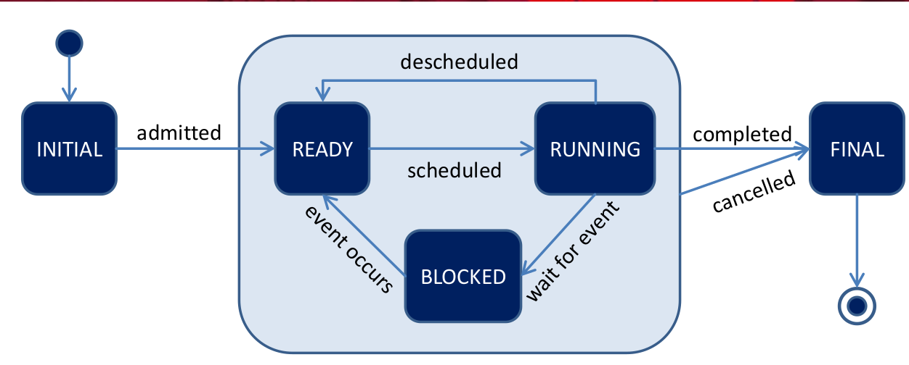



# Grundlagen betriebssysteme

> Abstrahiert und managet


## Abstrahiert:

Standard Bibl. für:

* CPU Prozesse & Threads
* Speicher virt. Addr.
* Platte Dateien & Verzeichnisse
* Netzwerk Sockets

PRO | CON
--- | ---
Nicht um Hardware Aufg. kümmern und bekommen einheitliche Geräteschnittstellen angeboten | Richt. Abstraktionslevel?
 -   | Welche Funktionalität?
  -  | Wie viel Hardware sehen?

## Managet

Moderator | Magier
--------- | ------
Teil Ressourcen zwisch. Anwender | Jede Anwend. hat Maschine für sich
Schirm Anwendungen ab | Speicher unendlich
   - | Dateien beliebig wachsen

PRO | CON
--- | ---
Anwend. gegenseitig nicht stören -> Zuteilung Fair & effektiv! | Wie Abschirmung?
- | Wie Hardware virtualisiert?
- | Wie Faire Zuteilung?

<!-- TODO Herausforderungen relevant ? (Folie 15 - 20) -->

# Virtualisierung der CPU

<!-- TODO Rechnerarchitektur ? (Siehe Folien) -->

* Prozesse: Sequentielle Ausführung eines Programms
  - Besteht aus:
    1. Programm => Adressraum
    2. Daten(Heap/Stack) => Adressraum
    3. Register
    4. Offene Dateien
    5. Netzwerk Verbind.

==> Werden im __PCB__ zusammengefasst!


Prozess | Programm
------- | --------
Ausfürung des Programms = __Dynamisch__ | __Statisches__ best. aus code & Daten

Prozess `<!=>` Programm

==> Zu Programm viele Prozesse & Jedes Programm **eindeutige PID**

## Programm ausführen

### Limited direct execution

1. Normale Prozesse -> **User Mode**(Restricted Mode)
2. BS -> **Kernel Mode**(Priviledged Mode)
  * Schreiben Geräteregister
  * Zugriff Memory
  * Anhalten CPU
  * Ändern Mode
  * Aktivierung/Deakt. Interrupts

==> __Protection Ring__(Current Privilege Level) = Prozessor prüft ob Berecht. vorliegen bei jeder Instruktion

#### Auf geschützte Funkt. zuzugreifen

> Kontrolle an BS wieder zurückzugeben

* Falltür um auf Kernelebebene abzusteigen = **Trap Konstr.**
* Interface um Funkt. auszuwählen:

```assembly
mov $0x4,%eax # Systemaufruf (4 = Linux write)
int $0x80     # Wechsel in den Kernel Mode(Trap)
```

Vorgang:

<!-- TODO write out instead of image -->


**Missachtung der Regeln**: BS terminiert Prozess

### BS managet Prozesse

1. Mechanismus: Dispatcher
  * Wie Prozess angehalten?
  * Wie Prozess gestartet?
2. Strategie: Scheduler
  * Wann Prozess angehalten?
  * Mit welchem fortgefahren?

#### Dispatcher Loop

1. Kooperativer Ansatz: Vertrauen auf Anwendungen
  * Systemaufruf(I/O) findet regelmäßig statt
  * `yield()`

=> Kein Zwang & fehlerhaft

2. Nicht Kooperativ: **Hardware Timer(HPET)** lösen in regelmäßige Abst.(~1ms) Interrupts aus.


> A process control Block(PCB) is a data structure used by computer operating systems to store all the information about a process. It is also known as a process descriptor.

### BS verwaltet Prozesse

> Prozesse haben Zustände



1. Initial: Prozess wurde erzeugt
2. Ready: Prozess ist in der Lage ausgeführt zu werden
3. Running: Prozess läuft(pro CPU ein Prozess)
4. Blocked: Prozess wartet auf bestimmtes Ereignis(z.B. I/O)
5. Final: Prozess beendet -> Es wird aufgeräumt

Queues in denen PCB's verwaltet werden:

1. **Ready Queue**: PCB Prozesse, die zur Ausfürung bereit wären
2. **Event Queue**: Queue für jede Art von Ereignis(Plattenzugriff, ...)

### Zusammenfassung CPU - Virtualisierung

1. Limited direct execution:

* Ausfürung bleibt schnell
* BS behält kontolle

2. Schnelle Kontextwechsel:

* Eindruck als besäße jeder Prozess eigene CPU

3. Hardware Unterstützung:

* Protection Ring
* Timer & Interrupts
* Sicherung & Wiederherstellung v. Zustandsinfos(Register)

<!-- TODO Prozesse & Erzeugung -->

## Scheduling

> Der Dispatcher führt Kontextwechsel durch, sichert und restauriert die Register, verwaltet die PCBs, usw... Dabei stehen viele Prozesse in der Ready Queue. Mit welchem soll jedoch der Kontextwechsel erfolgen?

Metriken zur Bewertung der Performance:

1. Umlaufzeit: T_Umlauf = T_Ende - T_Ankunft
2. Reaktionszeit: T_Reaktion = T_Start - T_Ankunft
3. Durchsatz = (erledigte Aufgaben)/Zeit

Berechnung der Fairness, nach Fairness-Index. Je näher dieser bei 1 ist, desto fairer.

<!-- TODO Fairness formel mit latex -->

### FIFO

* Performance: Bei etwa gleichlanger Prozess & wenn dursch. Umlaufzeit wichtig ist, FIFO adäquate Strategie.
* Problem: Dursch. Umlaufzeit steigt stark, wenn kurze Aufträge auf Beendigung langer Aufträge warten müssen.

### SJF

> Dursch. Umlaufzeit minimal gdw. Aufträge nach Dauer von kurz nach lang bearbeitet werden!

* Performance: SJF nur optimal, wenn Aufgaben bereits vorliegen -> Prognosen schwierig!

### STCF(Shortest Time to Completion First)

> Aufgabe, die zuerst fertig wird, wird vorgezogen

* _Präemptiv_: Scheduler kann einen beliebigen Job unterbrechen, um mit einem anderen(ggf. neuen) fortzufahren.
* Performance: Wenn Dauer Aufgabe bekannt, dursch. Umlaufzeit minimal gdw. stets an Aufgabe weitergearbeitet wird, die zuerst abgeschlossen werden kann.

> Anwender erwartet kurze Reaktionszeit:

* Reaktionszeit(Response Time): T_Reaktion = T_Start - T_Ankunft
* Performance bzglw. Reaktionszeit: Dursch. Reaktionszeit steigt stark sobald mehrere Prozesse(Jobs) zu bearbeiten sind!

### Round Robin

> Arbeiten mit **Zeitscheiben**, bei dem jeder Job eine Zeitscheibe zugeteilt wird.

* Zuteilung wiederholt sich periodisch.
* Je kleiner Zeitscheiben, desto größer der Eindruck der Gleichzeitigkeit

==> Je kleiner Zeitscheiben, desto kürzer Reaktionszeit(=Eindruck der Gleichzeitigkeit)

Zu beachten:

1. Größe der Zeitscheiben ist begrenzt durch Auflösung des HW-Timers(HPET ~ 1ms)
2. Kontextwechsel kostet Zeit(~1-1000µs)

### Zusammenhang Reaktionszeit <-> Umlaufzeit

> Was für Reaktionszeit gut, schlecht für Umlaufzeit & umgekehrt

Umlaufzeit | Reaktionszeit
---------- | ------------
SJF | RR
STJF | -

### MLFQ(Multi-Level-Feedback-Queue)

> Wissen aus Vergangenheit im Vorhersagen über Zukunft treffen um **Umlaufzeit & Reaktionszeit zu minimieren**

TLDR: Es wird ein Round Robin System genutzt, bei dem die Zeitscheiben an der Priorität gekoppelt sind. Diese wird aus der Zeit entnommen, die diese für die abarbeitung brauchen.

1. Alle Jobs werden Priorisiert

* Feste Anzahl an Queues, die ein definierten Prioritätslevel repräsentiert.
* Nur Jobs mit höchster Priorität werden ausgeführt.
* Scheduler = Round Robin

2. Priorität wechseln

* Jeder neue Job beginnt auf höchster Prioritätsstufe
* Bei nutzung des gesamten Zeitschlitzes, wird die **Priorität abgestuft**
* Bei nicht nutzung des gesamten Zeitschlitzes, wird die **Priorität behalten**


